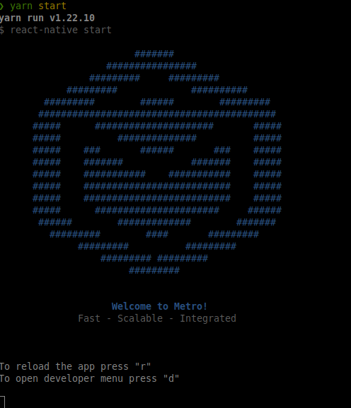
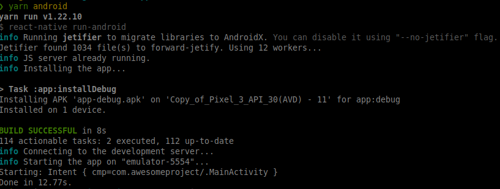

## :warning: Pré-requisitos

Para usar e testar o App em um simulador ou em seu smartphone, você já deve ter configurado o ambiente de desenvolvimento para aplicativos React Native. Você pode seguir o seguinte artigo para configurá-lo:

[Ambiente React Native (Android/iOS)](http://react-native.rocketseat.dev/)

---

## :information_source: Como Rodar

Você precisará do [Git](https://git-scm.com), [Node.js v10.16][nodejs] ou maior (recomendamos a versão estável - LTS) + [Yarn v1.13][yarn] ou maior instalada na sua máquina.

Clone e rode primeiramente a API do seguinte repositório

```console
https://github.com/thiagorpereira/user-registration-api
```

Em seguida, clone este repositório

```console
git clone https://github.com/thiagorpereira/user-registration-app
```

Navegue até o repositório

```console
cd user-registration-app
```

Instale as dependências

```console
yarn
```

Ajuste o .env com o seu IP adress e a porta 3333

```console
API_URL=http://192.168.0.133:3333
```

Execute o metro bundler

```console
yarn start
```

Certifique se aparece as boas-vindas do Metro com sua respectiva logo:

<div align="center"></div>

Em outro terminal, rode o emulador android ou iOS

```console
yarn android
```

```console
yarn ios
```

<div align="center"></div>

[nodejs]: https://nodejs.org/
[yarn]: https://yarnpkg.com/
